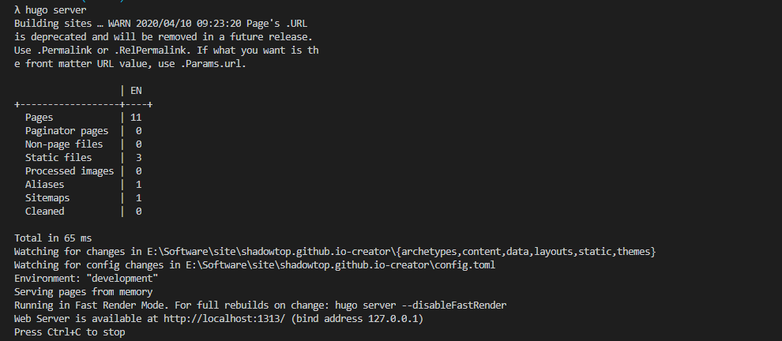

1. 安装hugo.exe
    * 下载 在[huge releases页面](https://github.com/gohugoio/hugo/releases) 下载例如hugo_0.68.3_Windows-64bit.zip 的压缩包，具体版本以自己的系统下载
    * 安装配置 将下载好的压缩包解压，将hugo.exe 放到E:\Software\hugo目录下，注意目录不要有空格和中文，然后将E:\Software\hugo\ 添加到PATH中，重启终端后，在Cmder中运行hugo version查看版本
2. 快速搭建博客
   * 访问[Hugo](https://gohugo.io/getting-started/quick-start/)官网，点击Quick Start按钮快速开始
   * 根据官网文档操作，会创建一个public目录，这个目录就是博客站点，可以使用hugo server进行网站预览
   